# Генератор QR-кодів Django / Django QR-code generator

English version is [_below_](#qr-code-generator).


## Можливості проєкту

- Проєкт для генерації QR-кодів.
- Можливість створення QR-кодів з покращеним зовнішнім виглядом.
- Різні варіанти створення вмісту QR-кодів.
- User-friendly інтерфейс.
- Генерація доступна як з доступом до інтернету (на хості), так і без нього (запустити локально). 


## План-навігація

- [x] [Склад команди](#склад-команди).
- [x] [Посилання на figma-дизайн та на figjam](#посилання-на-figma).
- [x] [Структура проєкту](#структура-проєкту).
- [x] [Детальне пояснення специфікації кожного застосунку у проєкті](#опис-застосунків).
- [x] [Покрокове пояснення, як запустити проєкт](#як-запустити-проєкт).
- [x] [Висновок](#висновок).


## Склад команди

1. [Бояркіна Орина](https://github.com/BoiarkinaOryna/Django_QRCodes)
2. [Філинська Дар'я](https://github.com/DariaFilinskaya/Django_QRCodes)
3. [Іванов Іван](https://github.com/Ivanov-ivan123/-Django_QRCodes)


## Посилання на Figma

###### [Фігма - дизайн](https://www.figma.com/design/dD4zavEELTEJJxVW2sgOng/QRCodes?node-id=0-1&p=f&t=hoq6ytxS9OIiShk8-0)
###### [Cтруктура баз даних](https://www.figma.com/board/fh5w7gS5vMyNq2XMGbz0t5/Untitled?node-id=1-158&t=GVmB93k6Oyui0oQP-0)


## Структура проєкту

1. Авторизація
    - Авторизація
    - Логаут
2. Контакти
3. Створення QR-кодів
    - Створення QR-кодів
    - Сторінка редіректу для кожного існуючого кода окремо
4. Головна
5. Сторінка перегляду QR-кодів, створених користувачем
6. Реєстрація
   
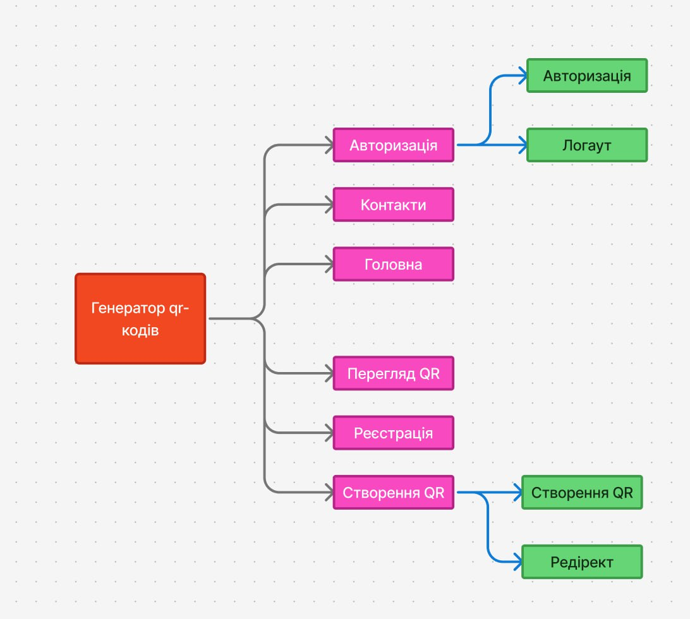

## Опис застосунків

1. На сторінці авторизації новий користувач авторизується у свій існуючий акаунт. 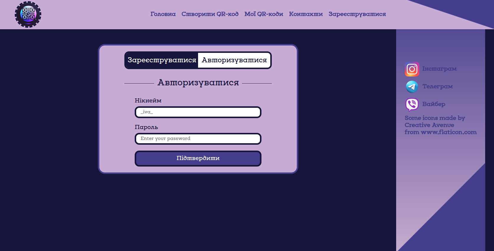

У функції відображення сторінки перевіряється, чи створено акаунт користувача і відбвувається логінцього кистувача.

```ruby
def render_authorization(request: HttpRequest):
    fail = False
    if request.method == "POST":
        username = request.POST.get('username')
        password = request.POST.get('password')
        user = authenticate(
            request = request,
            username = username,
            password = password
        )
        if user:
            login(request = request, user = user)
            return redirect("main")
        else:
            fail = True
    return render(
        request=request,
        template_name='authorization.html,
        context = {
            'fail': fail,
            'authenticated': request.user.is_authenticated
            }
    )
```
Розлогінитись можна з будь-якої сторінки сайту, натиснувши на відповідну картнку у шапці сайту.
У функції відображення користувача перенаправляє на сторінку входу в акаунт.

```ruby
def render_logout(request):
    logout(request = request)
    return redirect('authorization')
```

2. На сторінці контактів користувач може залишити зворотній відгук щодо сайту, при цьому вказавши, своє ім'я та прізвище, адресу
електронної пошти, тему відгуку і сам коментар. 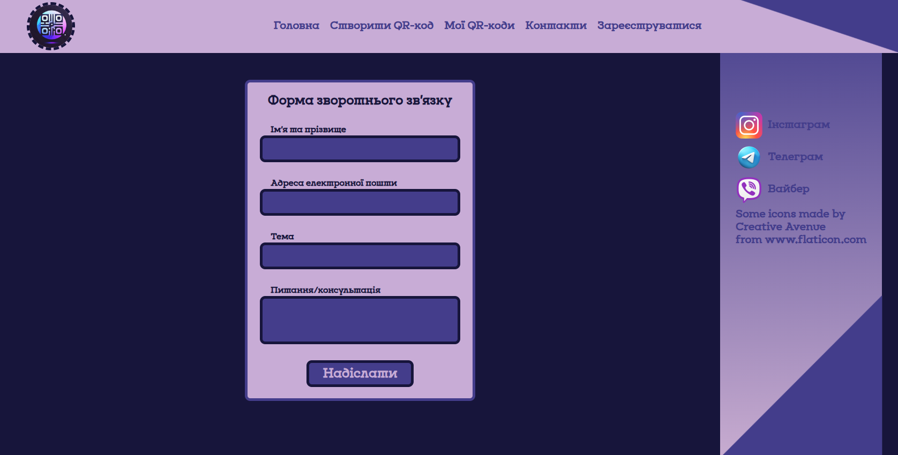

1. На головній сторінці присутні чотири варіанти покупки QR-кодів: 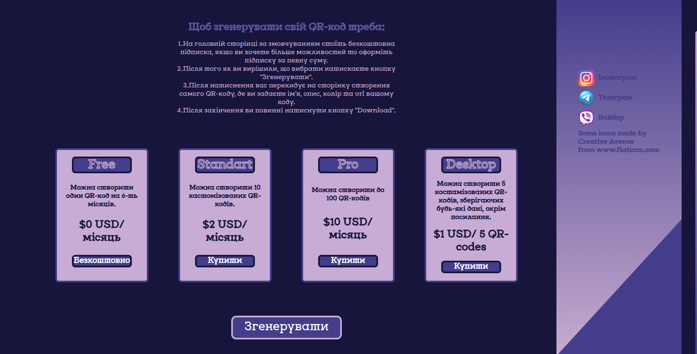
    - Перший (Free) за безкоштовно, у ньому можна створити один QR-код на 30-ть днів.
    - Другий (Standart) за 2$/місяць, у ньому можна можна створити 10 кастомізованих QR-кодів.
    - Третій (Pro) за 10$/місяць, у ньому Можна створити до 100 QR-кодів. 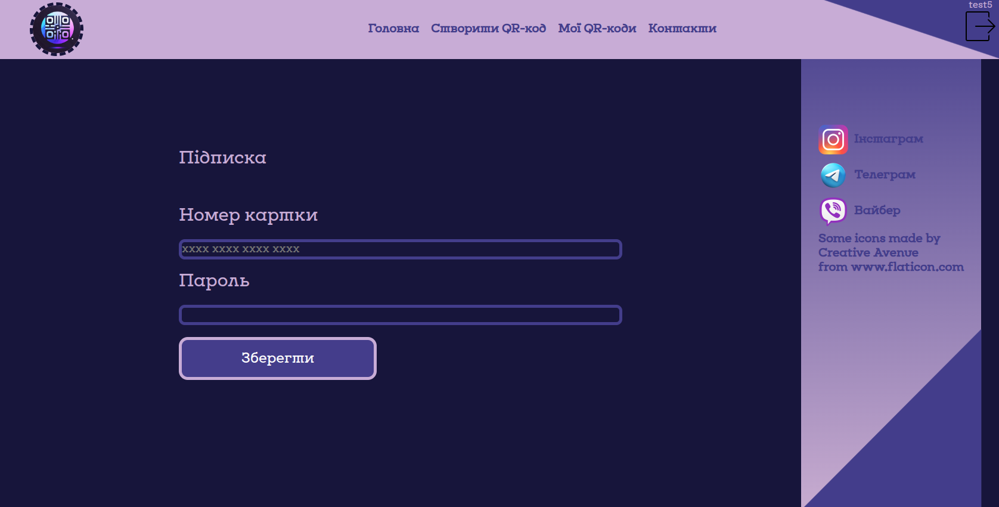
    - Четвертий (Desktop) $1 USD/ 5 QR-кодів, у ньому можна створити 5 костамізованих QR-кодів, зберігаючих будь-які дані, окрім посилання. 
    Також для цієї сторінки присутня модель Subscription, яка має у собі такі поля:
    - user - відповідає за користувача, що купує підписку
    - subscription - відповідає за сам вид підписок
    - desktopquantity - якщо користувач купив підписку desktop, то у цьому полі вказується максимальна кількість QR-кодів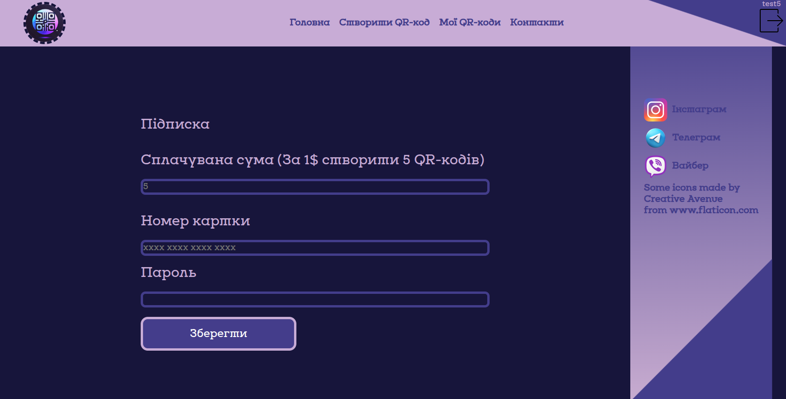
    Після того як користвач вибрав оптимальний для себе варіант, він натискає кнопку "Згенерувати".

```ruby
def render_main(request: HttpRequest):
    if request.method == "POST":
        if request.user:
            sub = SubForm(request.POST)

            if sub.is_valid():
                    sub.save(user_id = request.user.id)
                    return redirect("create_code")
        else:
            return redirect("registration")
    else:
        sub = SubForm()
    return render(
        request = request,
        template_name = "main.html",
        context = {
            'authenticated': request.user.is_authenticated,
            "form": sub,
        }
    )
```

2. На сторінці створення QR-кодів користувач спочатку кастомізує свій майбутній QR-код, а саме вибирає колір йому, за бажанням додає картинку, вибирає розмір. Після кастомізації створюється вже готовий QR-код. Для цієї сторінки була створена модель Code, в якій присутні такі поля:
    image_qr - відповідає за саму картинку QR-коду
    title - відповідає за назву QR-коду, потрібна лише на сторінці
    date_time - відповідає за час створення QR-коду
    expire_date - відповідає за закінчення дії QR-коду
    costomization - відповідає за кастомізацію QR-коду
    url - відповідає за посилання, прив'язане до QR-коду 
    color - відповідає за колір QR-коду
    bgcolor - відповідає за фон QR-коду
    creator - відповідає за користувача, що створив QR-код
    description - відповідає за опис  QR-кода
    center_image - відповідає за картинку, що знаходиметься у центрі  QR-кода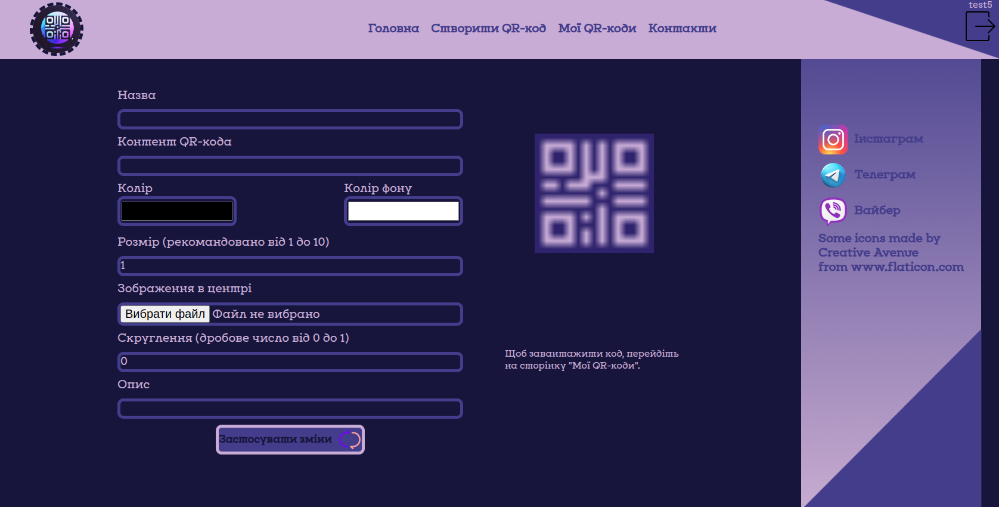

```ruby
@login_required
def render_create_code(request: HttpRequest):
    ...
    subscription = Subscription.objects.filter(user_id = user.id)
    for pk in range(len(subscription)):
        user_status = subscription[pk].subscription
    ...
    if not os.path.exists(folder_path):
        os.makedirs(folder_path)
    qrcode_image_path = f'{folder_path}/{title}.png'
    qr = qrcode.QRCode(
        version = version,
        error_correction = qrcode.constants.ERROR_CORRECT_H,
        box_size = 15,
        border = 2
    )
    ...
    image.save(qrcode_image_path)
    ...
    return render(
        request = request,
        template_name = "create_code.html",
        context = {
            'authenticated': request.user.is_authenticated,
            "code": code,
            'odd_number': number_error,
            "user_status": user_status,
            "is_desktop_mess_error": is_desktop_mess_error,
            "is_not_desktop_mess_error": is_not_desktop_mess_error,
        }
    )
```

3. На сторінці моїх QR-кодів відображатимуться зроблені користувачем QR-коди. 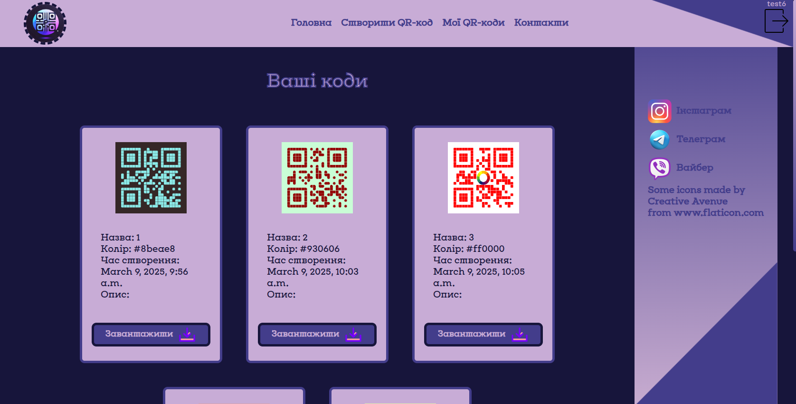

```ruby
@login_required
def render_my_codes_page(request: HttpRequest):
    codes = Code.objects.filter(creator = request.user)

    if request.method == "POST":
        code_name = request.POST.get("image_name")
        response = FileResponse(open(os.path.join(str(BASE_DIR) + "/media/" + str(request.user)) + f"/{code_name}.png", "rb"), as_attachment = True)
        return response

    return render(
        request = request,
        template_name = "my_codes.html",
        context = {
            'authenticated': request.user.is_authenticated,
            "user": request.user,
            "codes": codes
        }
    )
```

4. На сторінці реєстрації новий користувач вводить свої дані та створює свій пароль, який буде використовувати у майбутньому. 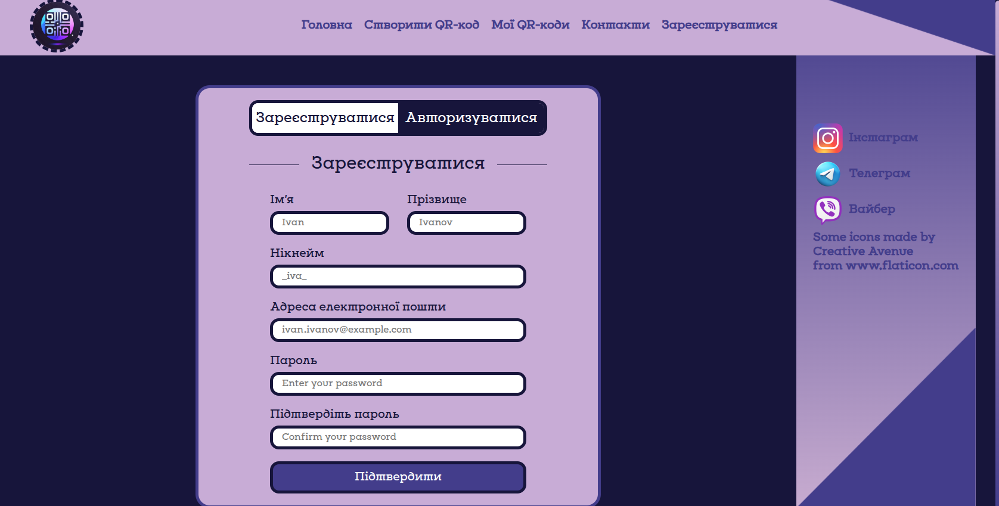

```ruby
def render_registretion(request: HttpRequest):
    if request.method == "POST":
        ...
        if password == confirm_password:
            try:
                User.objects.create_user(
                    username=username,
                    email=email,
                    password=password,
                    first_name=name,
                    last_name=surname
                )
                return redirect('authorization')
            except:
                create_user_error = True
        else:
            password_error = True
        
    return render(
        request=request,
        template_name='registration.html,
        context = {
            'authenticated': request.user.is_authenticated,
            'password_error': password_error,
            'create_user_error': create_user_error
        }
    )

```


## Як запустити проєкт

##### Для того, щоб запустити сайт локально - потрібно його завантажити.

> [!IMPORTANT]
> Якщо у Вас не завантажені git або python, то Ви можете це виправити, скориставшись відповідними інструкціями:

- [x] За допомогою [сайту](https://git-scm.com/downloads) можна завантажити git.
- [x] Щоб завантажити python, скористайтеся [сайтом](https://www.python.org/downloads).

1. По-перше, перейдіть за посиланням на [GitHub](https://github.com/BoiarkinaOryna/Django_QRCodes). 
Праворуч зверху від папок буде зелена кнопка __Code__, на яку треба натиснути.
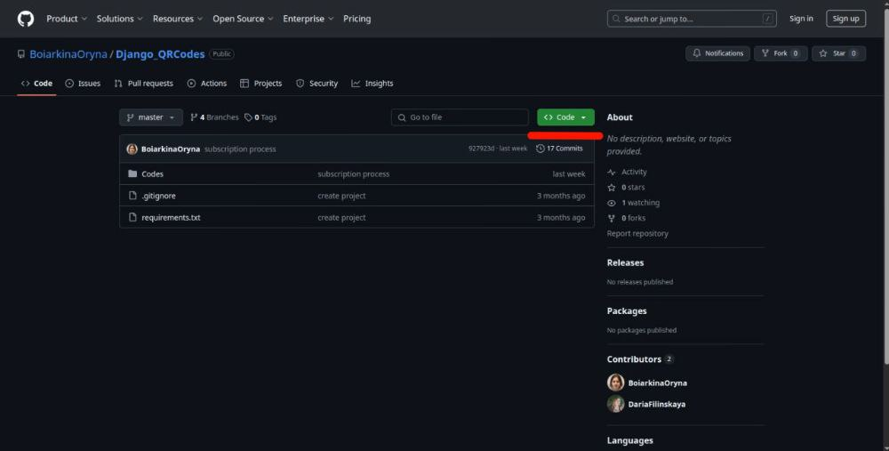
2. У Вас відкриється модальне вікно, з якого Ви зможете завантажити код двома способами.
- Склонувати проєкт, ввівши у терміналі (командному рядку), команду:
```ruby
git clone https://github.com/BoiarkinaOryna/Django_QRCodes.git
```
- Завантажити проєкт у zip-форматі (потім треба його розархівувати).
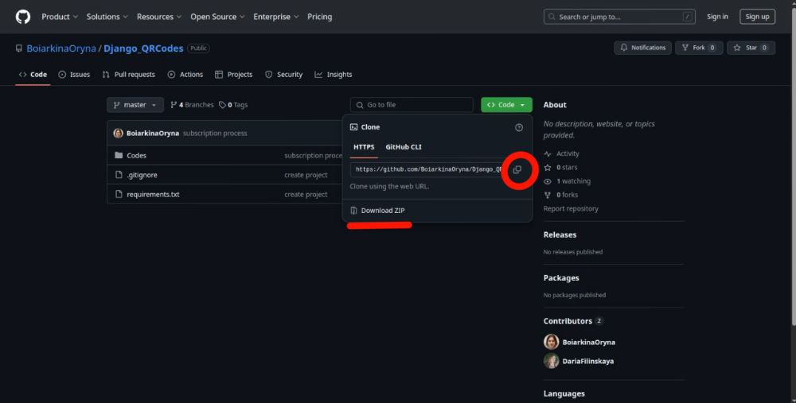
3. Відкрити папку з проєктом у середовищі для кодингу, наприклад, VS-code (завантажити можна [на сторінці](https://code.visualstudio.com/download)) і відкрити термінал у лівому верхньому кутку.
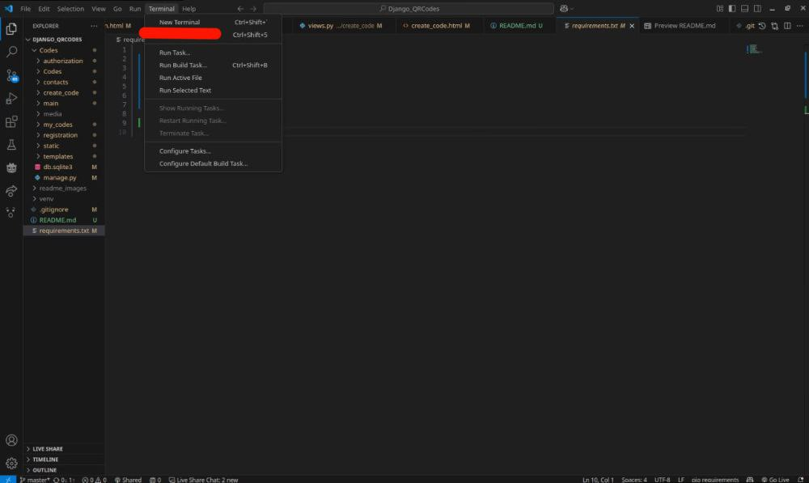
4. У терміналі введіть наступні команди:
> [!IMPORTANT]  
> Якщо Ви використовуєте Windows, після "pip" та "python" у наступних не ставити "3".
```ruby
pip3 install -r requirements.txt
```
Після цього, Вам завантажуться усі необхідні модулі. За бажанням можна створити віртуальне оточення.
Далі:

Після чого треба лише затиснути __cntrl__ і натиснути __лівою кнопкою миші__ на посилання.

## Висновок

- #### Ми застосовували багато технологій, як нових, так і старих, а саме:
1. Це був перший повноцінний проєкт на фреймворку Django.
2. Для контролю версій застосовувався git. За допомогою гілок, робота в команді була більш гнучною.
3. HTML, css - обличчя нашого сайту.
4. Щоб зменшити обсяг коду та дадавання різних можливостей під час роботи зі сторінками, ми працювали з jinja2. 
5. Для роботи на frontend, застосовувався JavaScript.
6. За допомогою бібліотеки qrcodes генеруються QR-коди.
7. Figma використовувалася для розробки дизайну, для систематизації застосунків та планування бази даних.
8. Інформація про користувачів, підписки та QR-коди зберігалася у базі даних sqlite.
9. Задіяна технологія віртуального оточення.

- #### Перший проєкт на Django виявився дуже корисним, оскільки ним ми самі користуємося у житті для різних своїх справ, не лише задля практики. Цей проєкт був дуже важливим, бо це початок нашої роботи з новим фреймворком, і сподіваємося, що не останній.
  
- #### Під час написання коду у нас виникало доволі багато труднощів, починаючи від найлегшого, як створення форми кастомізації QR-кодів, закінчуючи найскладнішим, як роботою з медіа-файлами. Також були проблеми з опрацюванням сторінки за допомогою __JavaScript__ та самостійним ознайомленням з бібліотекою __qrcodes__. Але ми легко вирішили ці проблеми, оскільки були готові до того, що буде багато нової інформації для нас, та усією командою швидко усе вивчили.
  
- #### Наш проєкт є універсальним QR-код сайтом, тому виправляти та додати майже нічого не треба, але звісно з часом, коли ми наберемося більшої практики, аніж зараз, то можна буде підкорегувати дизайн. Але якщо казати про удосконалення проєкта зараз, то можна додати більше варіантів покупки підписок, оскільки для кожної людини важко підібрати ідеальну для неї підписку. До сторінки створення кодів можна було б додати більше опцій кастомізації QR-кодів. 

# QR-code generator

## Project features

- A project for generating QR codes.
- The ability to create QR codes with an improved appearance.
- Various options for creating QR code content.
- User-friendly interface.
- Generation is available with the internet connection (host) and without it (local).


## Plan-navigation

- [x] [Team composition](#team-composition).
- [x] [Links to figma design and figjam](#links-to-figma).
- [x] [Project structure](#project-structure) .
- [x] [Detailed explanation of the specification of each application in the project.](#description-of-applications) 
- [x] [A step-by-step explanation of how to launch the project.](#how-to-launch-the-project) 
- [x] [Conclusion](#conclusion).


## Team composition

1. [Boyarkina Oryna](https://github.com/BoiarkinaOryna/Django_QRCodes)
2. [Filynska Daria](https://github.com/DariaFilinskaya/Django_QRCodes)
3. [Ivanov Ivan](https://github.com/Ivanov-ivan123/-Django_QRCodes)

## Links to Figma

#### [Figma design](https://www.figma.com/design/dD4zavEELTEJJxVW2sgOng/QRCodes?node-id=0-1&p=f&t=hoq6ytxS9OIiShk8-0)
#### [Database structure](https://www.figma.com/board/fh5w7gS5vMyNq2XMGbz0t5/Untitled?node-id=1-158&t=GVmB93k6Oyui0oQP-0)


## Project structure

1. Authorization
    - Authorization
    - Logout
2. Contacts
3. Creating QR codes
    - Creating QR codes
    - Redirect page for each existing code separately
4. Home
5. Page for viewing QR codes created by the user
6. Registration


## Description of applications

1. On the authorization page, a new user logs in to their existing account. 

```ruby
def render_authorization(request: HttpRequest):
    fail = False
    if request.method == "POST":
        username = request.POST.get('username')
        password = request.POST.get('password')
        user = authenticate(
            request = request,
            username = username,
            password = password
        )
        print("is_authenticated =", request.user.is_authenticated)
        if user:
            login(request = request, user = user)
            return redirect("main")
        else:
            fail = True
    return render(
        request=request,
        template_name='authorization.html,
        context = {
            'fail': fail,
            'authenticated': request.user.is_authenticated
            }
    )
```

- You can log in from any page of the site by clicking on the corresponding card in the header.
The display function redirects the user to the account login page.

```ruby
def render_logout(request):
    logout(request = request)
    return redirect('authorization')
```


2. On the contacts page, the user can leave feedback on the site, indicating his or her name and surname, e-mail address
e-mail address, the subject of the feedback and the comment itself. 

1. There are four options for purchasing QR codes on the main page: 
    - The first one (Free) is free and allows you to create one QR code for 30 days.
    - The second (Standard) for 2$/month, where you can create 10 customized QR codes.
    - The third (Pro) one costs $10/month and allows you to create up to 100 QR codes. 
    - The fourth (Desktop) is $1 USD/ 5 QR codes, where you can create 5 costumed QR codes that store any data except for a link. 
    There is also a Subscription model for this page, which has the following fields
    - user - responsible for the user who buys the subscription
    - subscription - responsible for the type of subscription
    - desktopquantity - if the user has purchased a desktop subscription, this field contains the maximum number of QR codes!
    After the user has chosen the best option for themselves, they click the Generate button.

```ruby
def render_main(request: HttpRequest):
    if request.method == "POST":
        if request.user:
            sub = SubForm(request.POST)

            if sub.is_valid():
                    sub.save(user_id = request.user.id)
                    return redirect("create_code")
        else:
            return redirect("registration")
    else:
        sub = SubForm()
    return render(
        request = request,
        template_name = "main.html",
        context = {
            'authenticated': request.user.is_authenticated,
            "form": sub,
        }
    )
```

2. On the page of creating QR codes, the user first customizes his future QR code, namely, chooses a color for it, optionally adds a picture, and selects the size. After customization, a ready-made QR code is created. For this page, the Code model was created, which contains the following fields:
    image_qr - responsible for the QR code image itself
    title - is responsible for the name of the QR code, it is needed only on the page
    date_time - is responsible for the time when the QR code was created
    expire_date - responsible for the expiration of the QR code
    costomization - responsible for customizing the QR code
    url - responsible for the link attached to the QR code 
    color - responsible for the color of the QR code
    bgcolor - responsible for the background of the QR code
    creator - responsible for the user who created the QR code
    description - responsible for the description of the QR code
    center_image - is responsible for the image in the center of the QR code!

```ruby
@login_required
def render_create_code(request: HttpRequest):
    ...
    subscription = Subscription.objects.filter(user_id = user.id)
    for pk in range(len(subscription)):
        user_status = subscription[pk].subscription
    ...
    if not os.path.exists(folder_path):
        os.makedirs(folder_path)
    qrcode_image_path = f'{folder_path}/{title}.png'
    qr = qrcode.QRCode(
        version = version,
        error_correction = qrcode.constants.ERROR_CORRECT_H,
        box_size = 15,
        border = 2
    )
    ...
    image.save(qrcode_image_path)
    ...
    return render(
        request = request,
        template_name = "create_code.html",
        context = {
            'authenticated': request.user.is_authenticated,
            "code": code,
            'odd_number': number_error,
            "user_status": user_status,
            "is_desktop_mess_error": is_desktop_mess_error,
            "is_not_desktop_mess_error": is_not_desktop_mess_error,
        }
    )
```

3. The My QR Codes page displays the QR codes created by the user. 

```ruby
@login_required
def render_my_codes_page(request: HttpRequest):
    codes = Code.objects.filter(creator = request.user)

    if request.method == "POST":
        code_name = request.POST.get("image_name")
        response = FileResponse(open(os.path.join(str(BASE_DIR) + "/media/" + str(request.user)) + f"/{code_name}.png", "rb"), as_attachment = True)
        return response

    return render(
        request = request,
        template_name = "my_codes.html",
        context = {
            'authenticated': request.user.is_authenticated,
            "user": request.user,
            "codes": codes
        }
    )
```

4. On the registration page, the new user enters his or her data and creates a password that will be used in the future. 

```ruby
def render_registretion(request: HttpRequest):
    if request.method == "POST":
        ...
        if password == confirm_password:
            try:
                User.objects.create_user(
                    username=username,
                    email=email,
                    password=password,
                    first_name=name,
                    last_name=surname
                )
                return redirect('authorization')
            except:
                create_user_error = True
        else:
            password_error = True
        
    return render(
        request=request,
        template_name='registration.html,
        context = {
            'authenticated': request.user.is_authenticated,
            'password_error': password_error,
            'create_user_error': create_user_error
        }
    )

```

## How to launch the project

##### To launch the site locally, you need to download it.

> [!IMPORTANT]
> If git or python are not loaded on your PC, you can fix it, using the following instructions:

- [x] Using [the site](https://git-scm.com/downloads) you can download git.
- [x] In order to install python, use [this site](https://www.python.org/downloads).

1. Firstly, follow the link to [GitHub] (https://github.com/BoiarkinaOryna/Django_QRCodes). 
At the top right corner of the folders, there will be a green __Code__ button that you should click.

2. You will be taken to a modal window from which you can download the code in two ways.
- Clone the project by entering the command in the terminal (command line):
```ruby
git clone https://github.com/BoiarkinaOryna/Django_QRCodes.git
```
- Download the project in zip format (then unzip it).

3. Open the folder with the project in a coding environment, for example, VS-code (download it [on the page](https://code.visualstudio.com/download)) and open the terminal in the upper left corner.

4. In the terminal, enter the following commands:
> [!IMPORTANT]  
> If you are using Windows, do not put a “3” after “pip” and “python” in the following commands.
```ruby
pip3 install -r requirements.txt
```
After that, all the necessary modules will be downloaded. If you wish, you can create a virtual environment.
Next:

After that, you just need to hold down __cntrl__ and click __left mouse button__ on the link.


## Conclusion

- #### We used many technologies, both new and old, namely:
1. This was the first full-fledged project on the Django framework.
2. We used git for version control. With the help of branches, teamwork was more flexible.
3. HTML, css are the face of our website.
4. We used jinja2 to reduce an amount of code and to provide different options when working with pages. 
5. To work on the frontend, we used JavaScript.
6. QR codes are generated using the qrcodes library.
7. Figma was used to develop the design, to systematize the applications and to plan the database.
8. Information about users, subscriptions and QR codes was stored in a sqlite database.
9. Virtual environment technology was used.

- #### The first Django project turned out to be very useful, as we use it in our lives for various things, not just for practice. This project was very important because it was the beginning of our work with the new framework, and we hope it won't be the last.
  
- #### When writing the code, we had quite a few difficulties, ranging from the easiest, like creating a QR code customization form, to the most difficult, like working with media files. There were also problems with the page processing using __JavaScript__ and getting acquainted with the __qrcodes__ library. But we easily solved these problems because we were prepared for the fact that there would be a lot of new information for us, and the whole team quickly learned everything.
  
- #### Our project is a universal QR code site, so there is almost nothing to correct or add, but of course, over time, when we have more practice than we do now, we can adjust the design. But if we talk about improving the project now, we can add more options for purchasing subscriptions, as it is difficult to find the perfect subscription for each person. More options for customizing QR codes could be added to the code creation page. 

